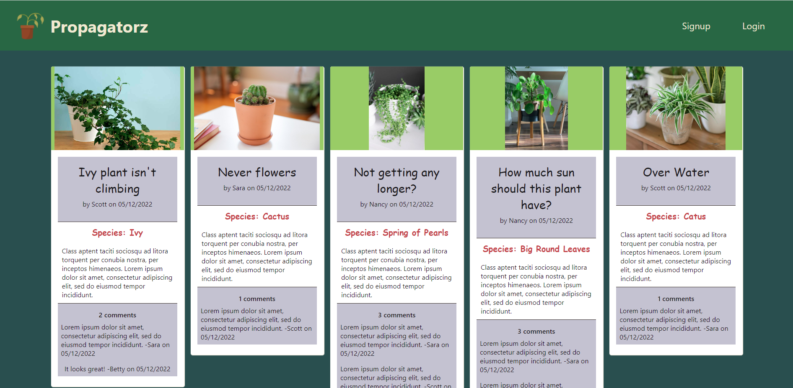

# Propagatorz

## Link to deployed app on heroku: https://propagatorz-plant-help.herokuapp.com/

## Table of Contents

-   [Introduction](#introduction)
-   [User Story](#user-story)
-   [Live Link & Screenshots](#live-link--screenshots)
-   [Technologies Used](#technologies-used)
-   [Contact Info/Maintainers](#contributors)
-   [Resources](#resources)

## Introduction

Propagatorz is a "plant help line" web application that allows users to share photos and notes regarding thier house plants.
Users will need to login or sign up first in order to start taking part in the discussions. The app is organized in typical React fashion with a client folder and server folder. The server holds the db configuration, db models, schemas and utilities that support the models. The client folder holds all of the function components and page components as well as the build folder that uses webpack to minify and serve the React assets. The client side also has all of the mongoose and graphql queries/mutations/actions/reducers that are ran inside the components.

## User Story

-   As a user I want to be able to upload a photo of my plant along with some other information describing the problem.  
-   As a user I want other users to be able to comment on my post to give me feedback on what the problem might be (i.e. over-watering).  
-   As a user I want to be able to see other user’s posts and leave my own comments.  
-   As a user I want to be able to log into my account so that I can create a new post and then filter all the posts so I can just see just my own posts.  
-   As a user I want to be able to update my posts.  

## Screenshots

Home Page  
  

## Technologies Used

-   React
-   CSS Framework
    -   [Mui](https://mui.com/material-ui/getting-started/installation/)
-   Node
-   Express
-   Bcrypt
-   MongoDB
-   Mongoose
-   GraphQL
-   Apollo Server
-   [Cloudinary](https://cloudinary.com/)
-   Nodemon
-   day.js

## Contributors

-   [Tony Linz](https://github.com/alinz07)
-   [Lindsey Dubnicka](https://github.com/lindseymiller2567)
-   [Cole Johnson](https://github.com/ColeVibes)
-   [Chris McLeod](https://github.com/Chris-McLeod2)

## Resources

-   Propagatorz Logo
    -   https://www.istockphoto.com/vector/dying-dry-dead-houseplant-in-a-plant-pot-flat-design-icon-isolated-on-white-gm1060392342-283437244
